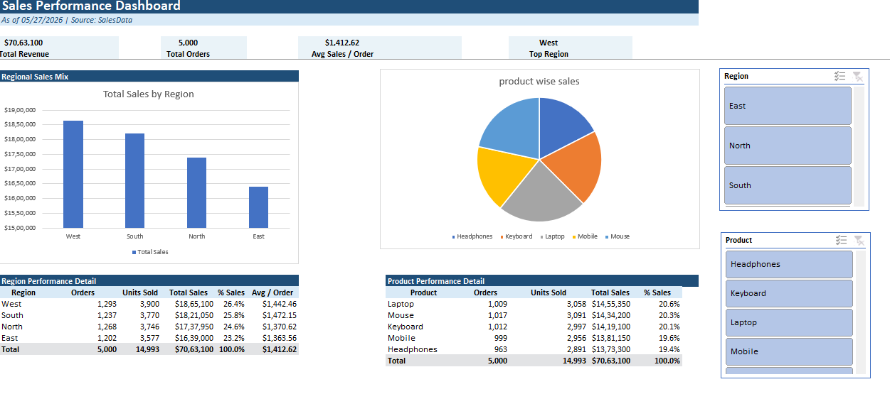

# AI-Assisted Interactive Sales Dashboard using Excel

## Project Overview
Developed an interactive sales analytics dashboard in Microsoft Excel using Pivot Tables, Pivot Charts, and Slicers for dynamic business reporting.

## Features
- Sales performance analysis
- Region-wise sales trends
- Product category insights
- KPI reporting
- Interactive slicers and filters
- AI-assisted analytics workflow

## Tools Used
- Microsoft Excel
- Pivot Tables
- Pivot Charts
- Slicers
- Power Query
- ChatGPT

## Dashboard Preview

## Project Highlights
- Built dynamic and interactive visualizations
- Performed data cleaning and filtering
- Improved reporting usability and efficiency
